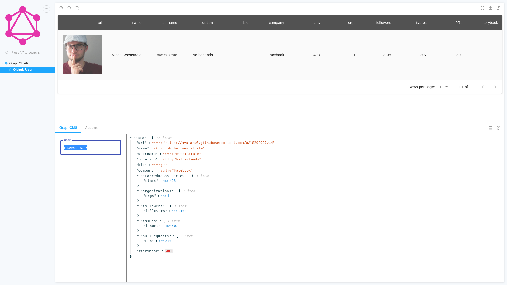

# Storybook Graphql Quick Start

Boilerplate project with:

- Storybook
- Storybook-addon-GraphCMS
- Configured GraphQL tools
- Demo connection to Github GraphQL API

[Demo](https://focusreactive.github.io/storybook-graphql-quick-start)

Out of the box you will have a Storybook based project ready to start writing GraphQL queries and preview the result



### Quick Start

```shell
git clone https://github.com/focusreactive/storybook-graphql-quick-start.git
cd storybook-graphql-quick-start
yarn
yarn start
```

you can use npm as well

As soon as Storybook is builded open http://localhost:6006/ your browser

Now you are ready to switch to your GraphQL endpoint and start writing your own queries

### Writing queries

Start with `queries/users.graphql`. If you edit it when Storybook is launched it will auto update immediately after save a file.

This project is configured to fetch introspection from GraphQL endpoint. It enables such features as query types checking and intelligent suggestion in you IDE

>Note: If you are using VS Code consider installing `prisma.vscode-graphql` extension to enable GraphQL features in your IDE


In order to add query result to Storybook, you need to create a "story" for that. See `queries/users.stories.js` for an example.

### Passing variables

Note how we can pass variables to your queries:

`vars: { org: 'storybookjs' }` - this is the list of variables that will be passed directly

`searchVars: { user: 'UsulPro' }` - that variables will appear in the addon panel and users can write own values. For example in the demo project you can input a Github user nickname to inspect a user.


### Configuring endpoint

Usually you need to set your GraphQL endpoint URL and Auth Token. The easiest way to do it is to specify them in the `.env` file.

See more settings in `.storybook/config.js`

### Documentation

See API references on Storybook-Addon-GraphCMS project readme

https://github.com/focusreactive/storybook-addon-graphcms#api

### Scripts

`yarn start` or `yarn dev` to launch Storybook locally

`update` - to update GraphQL schema introspection

`deploy:storybook` - to deploy your project to Github pages (if you're hosting your project on github)

### Tools

Here is a list of tools used in this project with links to documentation

[GraphQL](https://graphql.org/) GraphQL is a modern query language for server API

[Storybook](https://storybook.js.org/)  Storybook is an open-source tool for developing *(not only)* UI components in isolation for React, Vue, and Angular.

[graphql-config](https://github.com/kamilkisiela/graphql-config) One configuration for all your GraphQL tools (supported by most tools, editors & IDEs)

[graphql-cli](https://github.com/Urigo/graphql-cli) Command line tool for common GraphQL development workflows

[graphql-loader](https://github.com/samsarahq/graphql-loader) A webpack loader for .graphql documents

[storybook-addon-graphcms](https://github.com/focusreactive/storybook-addon-graphcms) Write GraphQL queries and pass response data to your components

[storybook-deployer](https://github.com/storybookjs/storybook-deployer) Deploy your storybook as a static site

[github-actions](https://help.github.com/en/actions/automating-your-workflow-with-github-actions) Automating your workflow with GitHub Actions

*Recommended:*

[vscode-graphql](https://github.com/prisma-labs/vscode-graphql) VSCode GraphQL extension (autocompletion, go-to definition, syntax highlighting)

### Github GraphQL API

This project includes initial settings for Github Graphql API. There is a demo token with read only access. Don't use it for development your project. If you are looking for creating Github service create you own token. See documentation here.

https://developer.github.com/v4/guides/intro-to-graphql/#discovering-the-graphql-api

## Contributing

Any contribution are welcome to this project! Feel free to open an issue or start a PR.

To develop this project:

1. git clone
2. yarn
3. yarn dev
4. open http://localhost:6006

for contributing to Storybook-Addon-GraphCMS see that project page:

https://github.com/focusreactive/storybook-addon-graphcms


## Credits

<div align="left" style="height: 16px;">Created with ❤︎ to <b>GraphCMS</b> and <b>GraphQL</b> community by <a href="https://twitter.com/UsulPro">Oleg Proskurin</a> at <a href="https://twitter.com/FocusReactive">FocusReactive</a>
</div>

2019

[](https://focusreactive.com)
